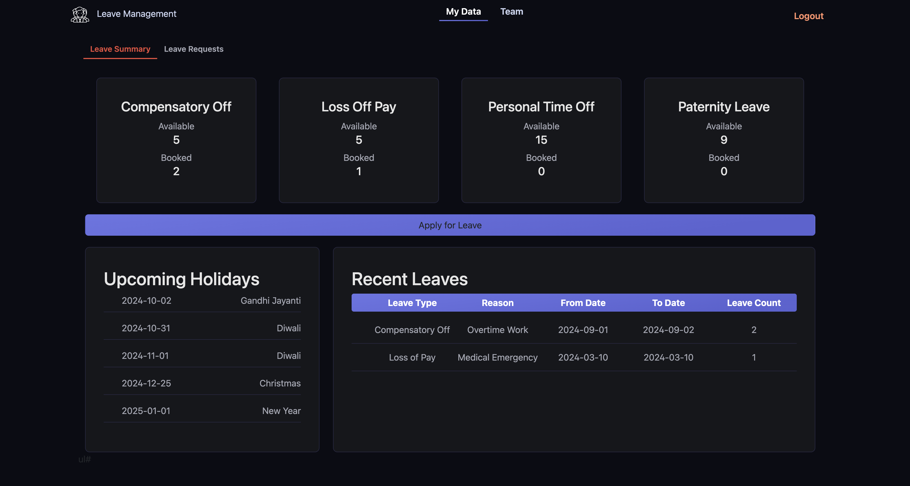

# Leave Management System

This project is a **Leave Management System** designed to streamline leave management for your organization. Employees can easily request leaves, track their remaining balance, and view team leave schedules.

---
## User Interface



## Features

The system offers a user-friendly interface with the following functionalities:

### Frontend
- Built using the powerful **Angular** framework for a smooth and responsive user experience.

### Backend
- Developed using **Java** for robust performance and scalability.
- Hosted on a reliable **Tomcat server** for efficient deployment.

---

## Installation

### Prerequisites

Before diving in, ensure you have the following tools installed:

- **Frontend:** Node.js and Angular CLI for building the user interface.
- **Backend:** Java Development Kit (JDK 11 or above) to compile the backend code.
- **Server:** Apache Tomcat server for deploying the backend application.
- **Database:** A database system like MySQL or PostgreSQL to store leave data (not included in this project).

---

### Setup

#### 1. Clone the Repository
```bash
git clone https://github.com/MaheshReddy-05/Leave-Management-Angular.git  
cd Leave-Management-Angular
